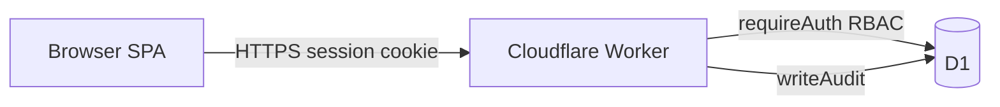

# DialyRounds Security

Technical security overview for deployment and compliance planning.

## Architecture

| Host | Purpose |
|------|---------|
| `dialyrounds.com` | Public marketing site only (`/`, `/security`, `/privacy`) |
| `app.dialyrounds.com` | Authenticated clinical app + `/api/*` |

Session cookies are scoped to the app subdomain. The app subdomain is excluded from search indexing (`X-Robots-Tag: noindex, nofollow`, `robots.txt` Disallow).



## Control inventory

| Control | Location |
|---------|----------|
| RBAC | `server/src/middleware/auth.ts` — `requireAuth`, `requireAdmin` |
| Password hashing | `server/src/utils/crypto.ts` — PBKDF2-SHA256, 100k iterations |
| Password policy | `shared/src/validators.ts` — 12+ chars, letter + number |
| Sessions | `server/src/middleware/auth.ts`, `shared/src/constants.ts` |
| Login lockout | `server/src/routes/auth.ts` — 5 failures / 15 min |
| Login audit + IP | `server/src/routes/auth.ts` — `CF-Connecting-IP` in audit details |
| Audit log | `server/src/utils/audit.ts`, `audit_log` table |
| Attested visit lock | `server/src/routes/attest.ts` (sign-off), `server/src/routes/visits.ts` (no PATCH after attest) |
| Host isolation | `server/src/index.ts`, `client/src/utils/routes.ts` |
| Security headers | `server/src/utils/response.ts` — `applySecurityHeaders` |
| API no-cache | `server/src/index.ts` — `Cache-Control: no-store` on `/api/*` |
| API host lock | `server/src/middleware/api-access.ts` — `/api` only on app host in production |
| API origin check | `server/src/middleware/api-access.ts` — mutating requests must come from app origin |
| PHI gate | `requirePasswordChanged` — clinical routes blocked until password changed |
| Production bootstrap | `POST /api/bootstrap` with `BOOTSTRAP_TOKEN` secret; no auto-seed admin in prod |

## HIPAA Security Rule mapping (technical safeguards)

DialyRounds is **not HIPAA-certified**. The table below maps implemented technical controls to common Security Rule expectations:

| Safeguard | Implementation |
|-----------|----------------|
| Access control (§164.312(a)) | Role-based routes; admin-only user management, reports, reassignment |
| Audit controls (§164.312(b)) | `audit_log` for auth, patient access, visits, attest, import/export |
| Integrity (§164.312(c)) | Attested visits immutable; visit mode locked at sign-off |
| Person/entity authentication (§164.312(d)) | PBKDF2 passwords, session tokens, login lockout |
| Transmission security (§164.312(e)) | HTTPS via Cloudflare; HSTS in production; secure cookies |

Organizational safeguards (policies, training, BAAs) remain the covered entity's responsibility.

## Authentication and sessions

- Passwords: PBKDF2-SHA256, 100,000 iterations, unique salt per user
- Minimum password: 12 characters with at least one letter and one number
- Sessions: random token, SHA-256 hash stored server-side
- Cookie flags: `HttpOnly`, `Secure` (production), `SameSite=Strict`
- Session lifetime: 24 hours maximum, 1 hour idle timeout (client + server)
- Forced password change on admin password reset; bootstrap admin created with chosen password

## Authorization model

Roles: `admin`, `physician`, `physician_assistant`

- Route handlers enforce authentication and admin middleware
- Clinical import/attest gated by role on client and server

**Known limitation (v1):** Any authenticated user can `GET /api/patients/:id` by patient ID without unit/shift verification. Acceptable for a single-practice deployment; tighten if multi-tenant access is required.

## Audit logging

`audit_log` records user id, action, entity type/id, details, and timestamp. Login events include client IP when provided by Cloudflare.

## Transport and headers (production)

- TLS terminated at Cloudflare edge
- `Strict-Transport-Security`, `X-Frame-Options: DENY`, `X-Content-Type-Options: nosniff`, `Referrer-Policy`, `Permissions-Policy`
- `Cache-Control: no-store` on all API responses

## API access controls

- **`/api/*` is not served on the marketing site** (`dialyrounds.com` returns 404).
- **In production, `/api/*` is only served on `app.dialyrounds.com`** (not `*.workers.dev` or other hosts).
- **Session required** for all patient, visit, attest, import/export, and unit endpoints (`401` without valid cookie).
- **Password change required** before any clinical data access if `mustChangePassword` is set (`403`).
- **Cross-origin writes blocked in production** — `POST`/`PATCH`/`DELETE` require `Origin: https://app.dialyrounds.com` (bootstrap excepted for one-time setup).
- **SameSite=Strict** session cookies prevent cross-site cookie submission from other domains.

## Data storage

- Cloudflare D1 (SQLite at edge)
- PHI must not be stored until Cloudflare **Enterprise BAA** is executed for Workers + D1

## Production first admin (bootstrap)

In production, the default dev admin is **not** auto-created.

1. Set a Wrangler secret: `npx wrangler secret put BOOTSTRAP_TOKEN`
2. After deploy, once per empty database:

```bash
curl -X POST https://app.dialyrounds.com/api/bootstrap \
  -H "Content-Type: application/json" \
  -d '{"token":"YOUR_TOKEN","email":"admin@yourorg.com","name":"Admin","password":"YourSecurePassword123"}'
```

3. Bootstrap seeds dialysis units and creates the first admin. Returns `409` if users already exist.

## Known limitations

- No multi-factor authentication
- No automated audit log export or retention policy
- No row-level patient scoping on direct GET-by-id
- D1 backup is manual (`wrangler d1 export`)
- Edge rate limiting on login recommended via Cloudflare dashboard (not in app code)

## Pre-PHI checklist

1. Sign Cloudflare Enterprise BAA
2. Run production bootstrap; do not use default dev credentials
3. Publish Privacy Policy and organizational policies
4. Risk assessment and workforce training
5. Document D1 backup procedure
6. Review minimum-necessary access quarterly
7. Enable Cloudflare WAF / rate limiting on `POST /api/auth/login`

## HIPAA disclaimer

DialyRounds implements technical safeguards aligned with the HIPAA Security Rule but is **not HIPAA-certified**. Covered entities remain responsible for organizational compliance.
